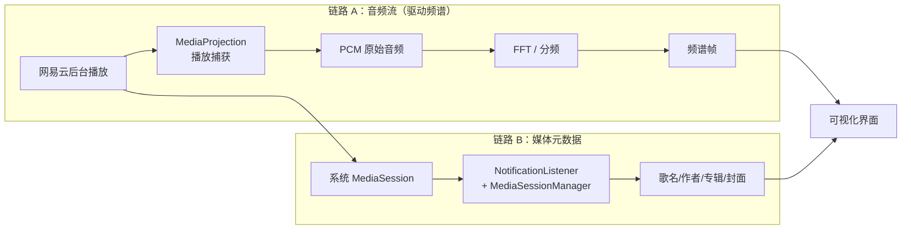

# 音频可视化 App —— 开发计划

> 目标：网易云音乐在**后台播放**时，打开本 App 即可显示 **频谱图 / 歌曲名 / 作者 / 专辑 / 专辑封面**。
> 策略：**先打通数据、做出功能完整的丑版本，再细化 UI。**
> 撰写日期：2026-10-05　|　状态：**阶段 0 / 1 / 3 已完成且真机验证通过；下一步做阶段 2（频谱 DSP）**
>
> **已确认参数**：`minSdk` **29** · 只锁定 **网易云音乐** · 阶段 4 做 **柱状频谱 + 波形** · 风格推迟到阶段 5

---

## 0. 真机实测结论（2026-10-05，联想 TB321FU）

测试机：`TB321FU` / Android **15** / API **35** / **arm64-v8a** / USB 调试已授权（序列号 `HA26RK7T`）。

| 实测项 | 结果 | 说明 |
|---|---|---|
| 已装音乐类应用 | ✅ | `com.netease.cloudmusic`（网易云，targetSdk **33**）、`com.tencent.qqmusic`（targetSdk 30）、`tv.danmaku.bilibilihd` |
| **网易云是否允许被捕获** | ✅ **允许** | `privateFlags` 含 `ALLOW_AUDIO_PLAYBACK_CAPTURE` |
| **QQ音乐是否允许被捕获** | ✅ **允许** | 同上 |
| 该标志的语义 | ⚠️ **是「默认值」而非「显式开启」** | 交叉比对：`com.android.settings` 等所有 targetSdk ≥ 29 的应用全都有此标志 → 说明 `android:allowAudioPlaybackCapture` 默认 = `targetSdk ≥ 29`，属**退出式（opt-out）**设计。**结论不变：只要目标 App 没显式声明 `false`，就能抓。** |
| 网易云是否用标准 MediaSession | ✅ | 声明了 `android.media.browse.MediaBrowserService` → 走 MediaSession/MediaBrowser 框架 → 元数据可从 MediaSession 读出 |

### 0.1 运行时实测（2026-10-05，网易云正在后台播放）

`dumpsys media_session` 抓到的真实会话：

```
MediaSession com.netease.cloudmusic/MediaSession/65
  active=true          flags=7          controllers: 9
  state=PlaybackState{state=PLAYING(3), actions=822, ...}
  audioAttrs=AudioAttributes: usage=USAGE_MEDIA content=CONTENT_TYPE_UNKNOWN flags=0x800
  volumeType=LOCAL
  metadata: size=11, description=INTERNET OVERDOSE (互联网重度依赖),
            NEEDY GIRL OVERDOSE/KOTOKO/Aiobahn +81, null
  queueTitle=null, size=14
```

| 观测项 | 实测值 | 判定 |
|---|---|---|
| `active` | `true` | ✅ |
| `state` | `PLAYING(3)` | ✅ 可自动判断「正在播放」 |
| `audioAttrs.usage` | `USAGE_MEDIA` | ✅ **播放捕获可命中**（`addMatchingUsage(USAGE_MEDIA)`） |
| `audioAttrs.flags` | `0x800`（= `FLAG_BYPASS_MUTE`） | ✅ **未设置 `FLAG_NO_SYSTEM_CAPTURE`(0x2000)**，不会阻断捕获 |
| `volumeType` | `LOCAL` | ✅ 本地播发（非蓝牙路由） |
| `metadata` | `size=11` | ✅ 字段丰富 |
| `metadata.description` | `…, …, null` | ⚠️ 第三段（专辑位）为 `null` |
| `queue` | `size=14` | ✅ 播放队列可用 |
| 网易云通知 | 2 条，均为 `BigTextStyle` 推广/播报类，**无 `android.mediaSession` extra** | ⚠️ **通知 extras 不是可靠兜底**；但 `android.largeIcon` 是 102×102 Bitmap（疑似封面小图） |

**关于 `description` 的解读（重要）**：它是 framework 用 `title, artist, album` 三段拼出的**摘要**，
所以标题与艺术家可用、专辑键疑似未设置。但也可能是网易云走的是
`METADATA_KEY_DISPLAY_*` 系列（网易云的历史习惯是把「专辑/歌手」合成一串塞进 `DISPLAY_SUBTITLE`）。
→ **必须用真实 API 打印完整 key 列表才能定论，不能靠 dumpsys 摘要判断。**

**因此元数据读取按「多键回退」实现**：

| 字段 | 取值顺序 |
|---|---|
| 标题 | `METADATA_KEY_TITLE` → `METADATA_KEY_DISPLAY_TITLE` → 通知 `EXTRA_TITLE` |
| 艺术家 | `METADATA_KEY_ARTIST` → `METADATA_KEY_DISPLAY_SUBTITLE` → 通知 `EXTRA_TEXT` |
| 专辑 | `METADATA_KEY_ALBUM` → `METADATA_KEY_DISPLAY_DESCRIPTION` → 从 subtitle 按 `/` 拆分 |
| 封面 | `METADATA_KEY_ALBUM_ART`（Bitmap）→ `METADATA_KEY_ART` → `*_ART_URI`（经 ContentResolver 解析）→ 通知 `EXTRA_LARGE_ICON` |

**已排除的路线**：`REMOTE_SUBMIX` / 全局 `Visualizer` 都要求 `CAPTURE_AUDIO_OUTPUT`（`signature|privileged`），普通应用拿不到，**Shizuku 也授不了**（shell 无权授签名级权限）。不再考虑。

### 0.2 阶段 0 探针实测结果（2026-10-05 · **两条链路全部打通 ✅**）

探针代码：`app/src/main/java/top/aerohaku/androidapp/probe/`（验证完删除）
报告文件：`/storage/emulated/0/Android/data/top.aerohaku.androidapp/files/probe-report.txt`

**音频通路**

| 项 | 结果 |
|---|---|
| 是否抓到声音 | ✅ **抓到，RMS 0.13 ~ 0.49** —— 媒体音频量级，不是麦克风环境音 |
| 可用 AudioFormat | ✅ `44100 Hz / CHANNEL_IN_MONO / PCM_16BIT`（**第一个候选即成功**，后续无需回退） |
| 是否需要 `RECORD_AUDIO` | ✅ **不需要**（全程 `granted=false` 依然抓得到）→ **不必申请麦克风权限** |
| 静音串长 | 全程 `0.00s`，无一段静音 |
| `addMatchingUsage(MEDIA/GAME/UNKNOWN)` | ✅ 成功 |
| `addMatchingUid(网易云)` | ✅ 成功（**但首次调用会失败，见下方「坑」**） |
| Android 15 前台服务时序 | ✅ 「先 `startForeground(type=mediaProjection)` → 再 `getMediaProjection()`」有效，无异常 |

**元数据通路（`metadata.size = 11`）**

| key | 实测值 |
|---|---|
| `TITLE` | `INTERNET OVERDOSE (互联网重度依赖)` |
| `ARTIST` | `NEEDY GIRL OVERDOSE/KOTOKO/Aiobahn +81` |
| `ALBUM` | ✅ `INTERNET OVERDOSE` |
| `ALBUM_ART` / `ART` / `DISPLAY_ICON` | ✅ **三者都是同一张 512×512 ARGB_8888 Bitmap** |
| `ALBUM_ART_URI` / `ART_URI` / `DISPLAY_ICON_URI` | 全为 `null` → **不需要解析 Uri，直接用 Bitmap** |
| `DURATION` | `220899` ms |
| `MEDIA_ID` | `1840401436`（网易云歌曲 ID） |
| `USER_RATING` | `Rating(style=1, rating=1.0)` → **「红心」状态可读** |
| `DISPLAY_SUBTITLE` | 与 `ARTIST` 完全相同 |
| `ALBUM_ARTIST` / `AUTHOR` / `WRITER` / `TRACK_NUMBER` | `null` / `null` / `null` / `0` |
| `queueSize` | `14` |

> 🔁 **推翻前面的推断**：`ALBUM` 键**是有值的**。之前 `dumpsys` 里 `description` 第三段显示 `null`，是
> framework 生成摘要的**时机问题**（早期 metadata 尚未填全），**不是元数据缺失**。多键回退表仍保留，
> 但实际只需读 `TITLE` / `ARTIST` / `ALBUM` / `ALBUM_ART` 四个标准键即可。

> ⚠️ **封面会二次刷新**：观测到同一首歌的封面从 `363×363` 升级为 `512×512`（网易云先给低清再给高清）。
> UI 层必须处理「同一首歌封面被替换」的情况，否则会一直显示低清版本。

**计划外的新发现（可直接利用）**

- `USER_RATING` → 可以显示/切换网易云的「红心」状态
- `MEDIA_ID` = 网易云歌曲 ID → 可反查歌词、更高清封面（B3 兜底方案的成本大幅降低）
- `queueSize = 14` → 播放队列可用，将来可做「接下来播放」

**⚠️ 坑：`getApplicationInfo(网易云).uid` 首次调用会抛异常**

- **现象**：第一次用 UID 过滤时抛异常 → `uid = null` → 4 个候选配置全部失败；**68 秒后再切回 UID 模式却成功了**
- **原因**：Android 11+ **包可见性（package visibility）** —— targetSdk ≥ 30 时必须声明才能查询到别的包
- **对策**：Manifest 里加
  ```xml
  <queries>
      <package android:name="com.netease.cloudmusic" />
  </queries>
  ```
- **教训**：探针第一版用 `runCatching { }.getOrNull()` 把真实异常类名吞掉了，导致只能靠猜。
  以后凡是「查不到」的分支，**必须把原始异常的类型和 message 记下来**。
- ✅ **已修复并验证**：加上 `<queries>` 后重跑，**首次调用即拿到 `uid=10269`**，
  `filter=UIDONLY` 下 RMS 0.24 ~ 0.42 正常，不再出现 ALL-FAILED。

**仍未覆盖的限制（留到阶段 6 验证）**

- DRM / 加密音轨（当前歌曲可抓，至少普通歌曲 OK）
- 耳机插入 / 蓝牙输出时的行为
- 来电打断、用户切走 App 后 `MediaProjection` 被系统回收的表现
- 长时间（>10 分钟）运行的发热与功耗

---

## 1. 需求拆解

问题拆成两条**互相独立**的数据链路，任一失败都不应拖垮另一条：



- 链路 A 决定「频谱能不能动」
- 链路 B 决定「信息栏有没有内容」
- **两者可独立降级**：A 挂了仍可显示元数据；B 不全会退化为只显示频谱

---

## 2. 实现方向对比

### 2.1 音频捕获（链路 A）

| 方案 | 能拿到什么 | 需要的权限 | 判定 |
|---|---|---|---|
| **A1. MediaProjection + `AudioPlaybackCaptureConfiguration`**（API 29+） | 其他 App 的媒体音频 PCM | 用户点一次系统「录制/投放」授权 + 前台服务 | ✅ **主方案**（本机已验网易云可抓） |
| A2. `AudioRecord` + `REMOTE_SUBMIX` | 系统混音 | `CAPTURE_AUDIO_OUTPUT`（签名级） | ❌ 排除 |
| A3. `Visualizer` 挂全局 session 0 | 全局频谱 | `CAPTURE_AUDIO_OUTPUT` | ❌ 排除 |
| **A4. 麦克风 `AudioRecord(MIC)`** | 环境音 | `RECORD_AUDIO` | ⚠️ **降级备选**（仅外放有效、音质差、易啸叫） |
| A5. Shizuku / Root | 提权 | — | ⚠️ 对 A 无帮助（授不了签名权限），排除 |

### 2.2 元数据（链路 B）

| 方案 | 能拿到什么 | 判定 |
|---|---|---|
| **B1. `NotificationListenerService` + `MediaSessionManager.getActiveSessions()`** | `MediaMetadata`：标题/艺术家/专辑/时长/`ALBUM_ART` Bitmap 或 art URI + `PlaybackState` | ✅ **主方案** |
| B2. 解析通知 `extras`（`EXTRA_TITLE` / `EXTRA_LARGE_ICON`） | 部分 App 元数据只落在通知上 | ✅ **兜底**，与 B1 合并使用 |
| B3. 第三方歌词/歌曲 API 反查 | 补齐缺失专辑/封面/歌词 | ⏸️ 后置，非必需 |

### 2.3 可视化形态（UI 部分，可多选、逐步加）

- ✅ **阶段 4 确定做：柱状频谱 + 波形/示波器**（+ 信息卡片）
- ⏸️ 阶段 5 再考虑：镜像频谱 · 环形/径向频谱 · 瀑布图 · 粒子/律动 · 封面为圆心的环形频谱 · 封面取色背景

---

## 3. 模块设计

```
app/src/main/java/top/aerohaku/androidapp/
├── MainActivity.kt                 入口；权限检查 + 触发捕获授权
├── Navigation.kt / NavigationKeys.kt   路由：Visualizer / Settings
├── capture/
│   ├── AudioCaptureService.kt      前台服务（foregroundServiceType=mediaProjection）
│   ├── PlaybackCapturer.kt         MediaProjection + AudioPlaybackCaptureConfiguration + AudioRecord 读循环
│   ├── CaptureController.kt        单例状态中枢（StateFlow），服务与 UI 共用
│   └── CaptureState.kt             Idle / Requesting / Running / Denied / Error
├── dsp/
│   ├── Fft.kt                      radix-2 FFT（自实现，零依赖）
│   ├── Window.kt                   Hann / Blackman 窗
│   ├── SpectrumAnalyzer.kt         分帧 → 加窗 → FFT → 幅度 → 频带聚合 → 时间平滑
│   └── AudioFrame.kt               输出：FloatArray 频带 + 波形 + RMS/峰值
├── metadata/
│   ├── NowPlayingListenerService.kt  NotificationListenerService
│   ├── MediaSessionWatcher.kt        监听 activeSessions / MediaController.Callback
│   ├── NowPlaying.kt                 data class(title, artist, album, artUri, artBitmap, duration, position, isPlaying, packageName)
│   └── ArtworkLoader.kt              封面加载 + LRU 缓存 + 占位图
├── permission/PermissionHelper.kt    通知使用权跳转 / 状态检测
└── ui/
    ├── visualize/  VisualizerScreen.kt + VisualizerViewModel.kt
    ├── components/ SpectrumBars.kt · Waveform.kt · NowPlayingCard.kt · PermissionGate.kt
    ├── settings/   SettingsScreen.kt
    └── theme/
```

**关键技术约束（写代码时必须遵守）**

- ✅ **已定：`minSdk` 由 24 升到 29**（`AudioPlaybackCaptureConfiguration` 本身就是 API 29 起；覆盖 Android 10 及以上）。
- Manifest 需要：
  - `FOREGROUND_SERVICE`、`FOREGROUND_SERVICE_MEDIA_PROJECTION`（API 34+）、`POST_NOTIFICATIONS`（API 33+）
  - `<service android:foregroundServiceType="mediaProjection">`
  - NotificationListenerService 带 `BIND_NOTIFICATION_LISTENER_SERVICE`
  - `RECORD_AUDIO`：**播放捕获大概率不需要**，阶段 0 验证后再决定是否声明（能不加就不加，避免麦克风隐私指示器常亮）
- **API 34/35 顺序要求**：必须 **先 `startForeground(type=mediaProjection)`，再 `getMediaProjection()`**；`MediaProjection.stop()` 后 token 作废，下次需重新弹窗授权。
- ✅ **只抓网易云**：`addMatchingUid(uid of com.netease.cloudmusic)`（uid 由 `PackageManager.getApplicationInfo(...).uid` 取得）。既满足「只做网易云」的决定，又天然避免抓到自己 App 的输出导致啸叫。
- 播放捕获只能拿到 `USAGE_MEDIA` / `USAGE_GAME` 类音频；**受 DRM 保护的音轨抓到的是静音**。

---

## 4. 阶段划分

### 阶段 0 —— 可行性验证（**最高优先级，先做，1~2 天量级**）

用**最小代码**证明两件事，做完立即知道整体方案是否成立：

- **0.1 音频通路**：一个按钮 → MediaProjection → `AudioRecord` 读循环 → 把 **RMS 值**打到 logcat / 屏幕上的数字。
  - ✅ 判据：**数字随音乐跳动** → 通路成立
  - 同时顺带验证：是否需要 `RECORD_AUDIO`、Android 15 前台服务顺序、ZUI 是否额外拦截、实际采样率/声道、静音判定
- **0.2 元数据通路**：开启通知使用权 → 打印 `MediaMetadata` 的 title / artist / album + 封面 Bitmap 尺寸
  - ✅ 判据：网易云切歌时能打印出正确信息且封面非空
- **0.3 记录结论**到本文档「实测结论」节 + `agents_mem.md`

> ⚠️ **若 0.1 失败**：立刻改走降级路线（麦克风 / 元数据-only），不要继续往后做——这是整个计划唯一的致命分支点。

### 阶段 1 —— 骨架与权限流
权限引导页（通知使用权 + 捕获授权）→ 前台服务 + 通知（含停止按钮）→ `CaptureController` 状态通道 → 导航（可视化页 / 设置页）。
**产出**：能启动/停止捕获，界面正确反映状态。

### 阶段 2 —— 音频链路（DSP）
环形缓冲（采集线程 → 分析线程）→ 加窗 → FFT → 频带聚合（对数分 bin 或 1/3 倍频程）→ 峰值保持 + 衰减平滑 → 以 30~60fps 输出 `AudioFrame`。
**产出**：**能画出频谱柱**（先正确，不求好看）。附 FFT 单元测试（已知正弦波校验）。

### 阶段 3 —— 元数据链路
NotificationListenerService 注册与授权检测 → MediaSession 监听 → `NowPlaying` → 封面加载/缓存 → 切歌/暂停/播放跟随 → 通知 extras 兜底。
**产出**：信息卡片显示歌名/作者/专辑/封面，与播放状态同步。

### 阶段 4 —— 基础 UI（功能完整 = "基本功能" 里程碑）
频谱柱 + 波形 + 信息卡片；竖屏 / 横屏 / 平板可用；空状态（无捕获 / 无音乐 / 权限缺失）都有明确文案。
**产出**：**可用版本 v0.1**。

### 阶段 5 —— UI 细化
视觉风格（见「待确认问题」）· 多种可视化形态（环形/瀑布/粒子/封面圆心）· 封面取色背景 · 动效与过渡 · 绘制性能优化（避免重组、限制帧率）· 主题/深色/edge-to-edge/大屏。

### 阶段 6 —— 稳定性与打磨
生命周期（进程被杀、服务重启、旋转、后台）· 功耗（空闲降频）· 多 App 兼容（QQ音乐 / bilibili / 本地播放器）· 耳机与蓝牙输出 · 来电打断 · 图标与应用名 · release 签名打包。

---

## 5. 风险与对策

| 风险 | 影响 | 对策 |
|---|---|---|
| ROM 拦截播放捕获 / 抓到静音 | **核心功能失败** | 阶段 0 先验证；降级麦克风或元数据-only |
| DRM / 加密音轨抓不到 | 部分歌曲无频谱 | 检测持续静音 → 提示「该曲目不支持」 |
| `MediaProjection` 每次启动需用户授权 | 体验（多点一次） | 保持服务存活；无法绕过（系统硬性要求） |
| 网易云元数据字段不全（缺封面/专辑） | 信息栏不全 | 通知 extras 兜底；B3 第三方 API 补 |
| 前台服务限制（API 34/35） | 服务起不来 | 严格按顺序 `startForeground` → `getMediaProjection` |
| 常驻 FFT 耗电发热 | 体验 | 降采样、降 FFT 点数、暂停/静音时停分析 |
| 抓到自己 App 的声音 | 啸叫 | `addMatchingUid` 精确限定目标 App |

---

## 6. 已确认参数（2026-10-05）

| 项 | 决定 |
|---|---|
| `minSdk` | **29**（由 24 升级） |
| 目标 App | **只锁定网易云** `com.netease.cloudmusic` |
| 阶段 4 可视化形态 | **柱状频谱 + 波形** |
| 视觉风格 | ⏸️ 推迟到阶段 5 |
| 歌词 | ⏸️ 后置 |
| `RECORD_AUDIO` | **不申请**（实测播放捕获不需要，避免多余的权限弹窗与隐私顾虑） |

**只锁定单一 App 的好处**：不需要 App 选择器、不处理多会话竞争、`addMatchingUid` 语义清晰。
**代价**：将来要兼容 QQ 音乐 / bilibili 时，需要重构成「目标 App 列表」。

---

## 6.1 频谱显示方案：复刻 mfosu（2026-10-05 决定）

**背景**：阶段 2 的频谱经过多轮调参（tilt 倾斜补偿、对数弯曲频率轴、频带峰值聚合、y 轴映射）
仍未达到用户预期。用户提供了参考实现 `AndroidApp/reference/` —— **mfosu**，
即 osu! 的音乐播放器插件（IGPlayer 的 Bar Spectrum）。

**决定**：**放弃自研的 dB 域频谱，整体改为复刻 mfosu 的模型**。
旧实现备份在 `docs/legacy/`。

### mfosu 的真实实现（从源码确认，非猜测）

```
BassAmplitudeProcessor.Update() → ChannelGetData(DataFlags.FFT512)
ChannelAmplitudes.AMPLITUDES_SIZE = 256          # 线性频率格，每格 86.1Hz @44.1k
MusicVisualizerDrawable.used_amplitude_count = 160  # 只用前 160 格 ≈ 0~13.8kHz
bin = (int)(bar * 160 / barCount)                # 整除截断
ApplyData: 新值更大就顶上去，并记住峰值
UpdateData: current -= peak / decayMs * dt       # 线性幅度衰减，峰值→0 恰好 decayMs
MathExtensions.Smooth(severity)                  # 就地箱式平滑
绘制: 高度px = 幅度 × HeightMultiplier           # 线性幅度，矩形窗
```

### 与旧方案的关键差异

| | 旧（已废弃） | mfosu（现行） |
|---|---|---|
| FFT 尺寸 | 2048 | **512** |
| 频率轴 | 48 条对数弯曲频带 | **120 根柱，线性采样前 160 格** |
| 每柱取值 | 频带内峰值 + 带宽偏差修正 | **单个 bin 的原始幅度** |
| 数值域 | dB（跨 75dB） | **线性幅度 0..1** |
| 时间平滑 | dB 域快攻慢放 | **峰值保持 + 线性幅度衰减** |

### 参数（与 mfosu 设置面板一一对应）

| 本实现 | mfosu | 取值 |
|---|---|---|
| `DEFAULT_BAR_COUNT` | `BarCountB` | 120 |
| `DEFAULT_DECAY_MS` | `DecayB` | 200 |
| `DEFAULT_DISPLAY_GAIN` | `MultiplierB / 画布高度` | **6.4**（非 mfosu 的 2.0，见下） |
| `DEFAULT_SMOOTHNESS` | `SmoothnessB` | 1 |

⚠️ **`displayGain` 是唯一无法从源码确定的量**：它把 BASS FFT 的绝对标度换算成屏幕高度，
而 BASS 的归一化系数不可见。真机逐帧实测在 gain=2.0（照抄 mfosu）时全局峰值只到画面 **49%**，
用户与 mfosu 对比后确认 **6.4** 可用。以后若换采集源导致整体偏高/偏矮，优先调它。

---

## 7. 下一步

1. ~~确认方向问题~~ ✅（见第 6 节）
2. ~~阶段 0：可行性验证~~ ✅ 两条链路全部打通，探针代码已删
3. ~~阶段 1：骨架与权限流~~ ✅ 权限引导 / 前台服务 / `CaptureController` / 导航全部就位
4. ~~阶段 3：元数据链路~~ ✅ **提前完成**（封面 / 曲名 / 作者 / 专辑 / 时长 / 红心 + 歌词同步）
5. 🚧 阶段 4：基础 UI —— **部分完成**。信息栏、歌词、实时电平已有；**频谱图还没做**
6. **▶ 下一步：阶段 2 —— DSP 频谱链路**
   - 环形缓冲（采集线程 → 分析线程）
   - 分帧 → 加窗（Hann）→ FFT → 幅度 → 对数分 bin / 1/3 倍频程聚合
   - 峰值保持 + 衰减平滑 → 以 30~60fps 输出频谱帧
   - 单元测试：FFT 对已知正弦波（与 LRC 一样是纯 JVM 逻辑，可直接测）
   - 完成后回到阶段 4 补上「柱状频谱 + 波形」，才算真正的「基本功能完整」
7. 之后：阶段 5（UI 细化）/ 阶段 6（稳定性与打磨）

> 📌 **已实现的额外能力**（不在原始需求内，白拿的）：网易云「红心」状态、
> 歌曲 ID 反查、歌词（含翻译）、自动启停、诊断页。

---

## 8. 执行日志

| 日期 | 事项 |
|---|---|
| 2026-10-05 | 真机（TB321FU）静态验证：网易云/QQ音乐均带 `ALLOW_AUDIO_PLAYBACK_CAPTURE`；确认该标志为 targetSdk ≥ 29 的**默认值**（退出式）；网易云声明 `MediaBrowserService`。排除 REMOTE_SUBMIX / 全局 Visualizer 路线。计划成形，参数确认 |
| 2026-10-05 | `dumpsys media_session` 运行时验证：网易云 `state=PLAYING`、`usage=USAGE_MEDIA`、`flags=0x800`（无 `FLAG_NO_SYSTEM_CAPTURE`）、`volumeType=LOCAL`、`metadata.size=11` |
| 2026-10-05 | **阶段 0 探针完成并通过全部验证**。音频：RMS 0.13~0.49、`44100/MONO/PCM_16BIT` 首选即成功、**`RECORD_AUDIO` 不需要**；元数据：`TITLE/ARTIST/ALBUM` 齐备、封面为 512×512 Bitmap（URI 全 null）、额外拿到 `MEDIA_ID`/`USER_RATING`/`queueSize`。发现并修复 **Android 11+ 包可见性**坑（补 `<queries>`）。探针代码已删除 |
| 2026-10-05 | 清理后 clean 构建通过，debug APK = **28.78 MB**（增量构建会因残留 dex 膨胀到 38 MB，测体积须先 clean）。`minSdk` 定格 29；Manifest 保留 3 个权限 + `<queries>`，不声明 `RECORD_AUDIO` |
| 2026-10-05 | **大步推进：自动启停 + 封面/曲名/作者 + 网易云歌词抓取，三项真机验证全部正常**。新增 `model/` `playback/` `lyrics/` `capture/` `permission/` `ui/visualizer/` `ui/settings/` 共 11 个文件；LRC 解析器带 14 个单元测试（全过）。歌词接口 `music.163.com/api/song/lyric?id=<MEDIA_ID>`，零第三方依赖（`HttpURLConnection` + `org.json`）。自动启停策略：**服务长期持有投影，只启停「读音频」**，避免重新弹授权 |
| 2026-10-05 | 踩到并修掉两个坑：**坑七** 重命名 `NotificationListenerService` 会让系统里按组件全名记录的「通知使用权」失效（看着有权限但永不绑定）；**坑八** Compose 里「超时后报警」的 effect 没把被等待状态作为 key → 误报且提示永不消失 |
| 2026-10-05 | **真机复测全部通过**：封面/曲名/作者显示、歌词同步、跟随播放自动启停、切歌跟随、切出切回无异常提示。本轮里程碑定稿 |
